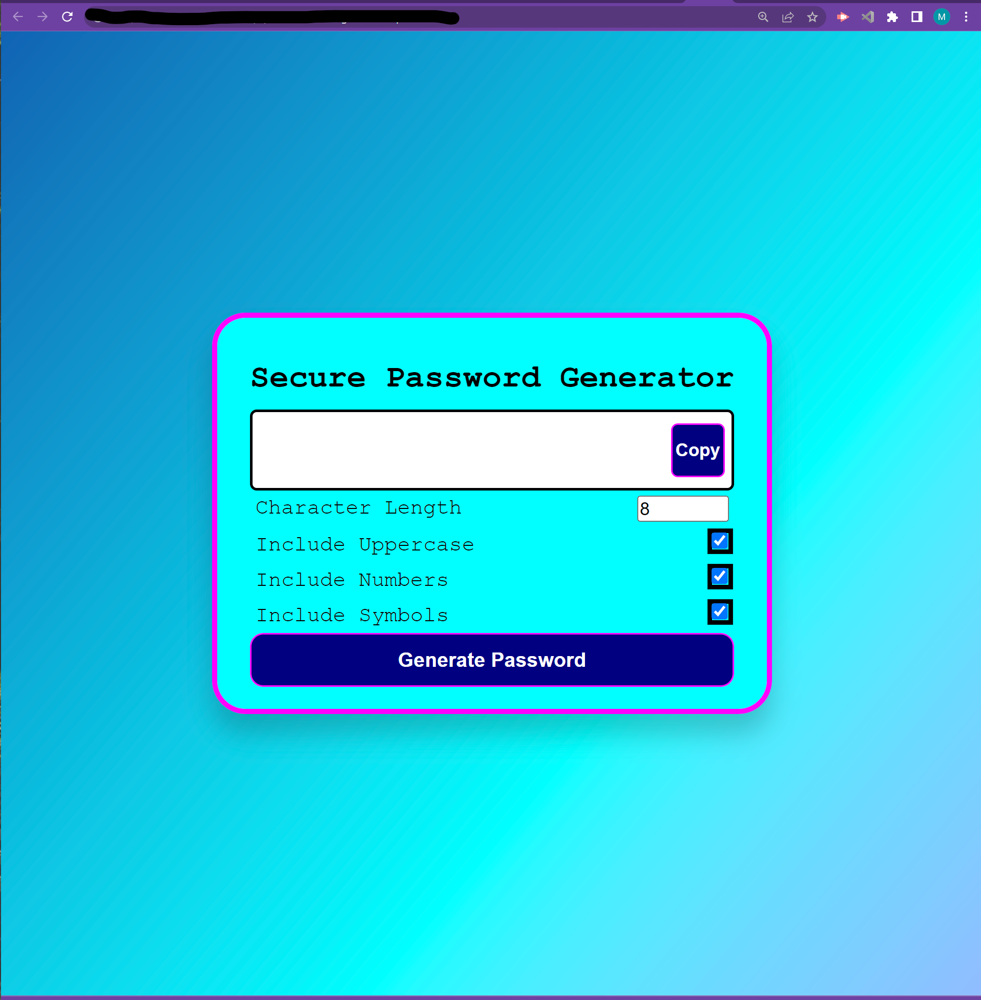
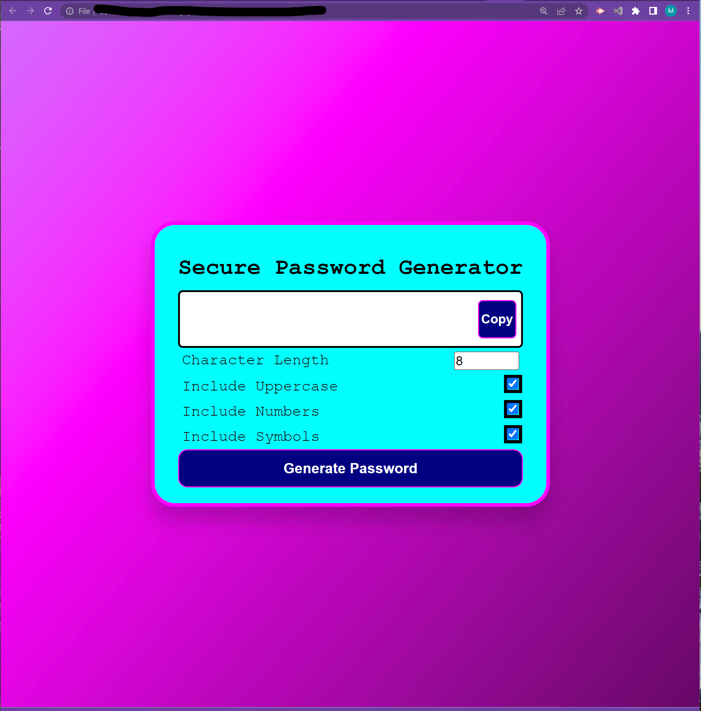
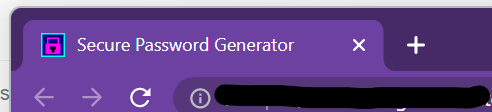
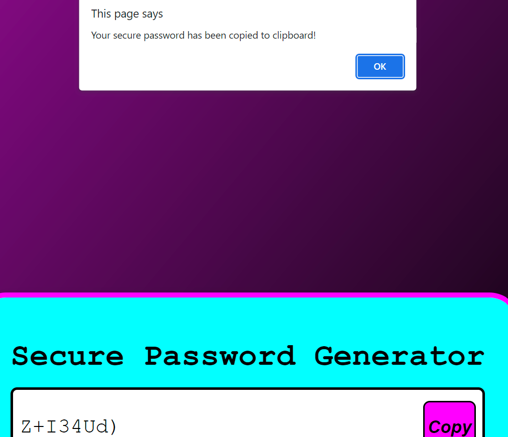

#  Password Generator - v2.0
Development of project began in March 2022.  
#### By: Megan Beekman [ a student of The OSU Coding Bootcamp (2022) ] 
---------------------------------------------------------
#### Developed with: 
##### HTML 
##### CSS 
##### JS 
----------------------------------------------------------
### Links:
#### [GitHub repository: ]()  
#### [Deployed project url: ]()  
----------------------------------------------------------
## Screenshots:

 

###  
 Background features linear-gradient colors with CSS Animation 

 

### 
 Created a custom favicon for the browser  

 

### 
 User can copy their generated password to clipboard 

-----------------------------------------------------------
### Sources:
- MDN Webdocs
- The OSU coding bootcamp (modules/lessons, classes, etc.)
- Youtube
- stackoverflow
- ... and last, but certainly not least -- Google

------------------------------------------------------------
